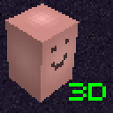
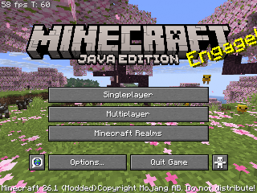
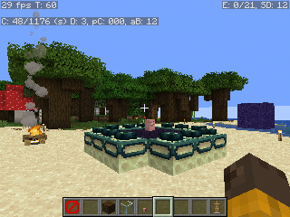
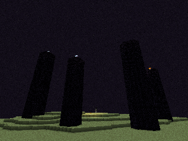
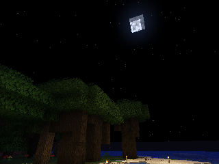

# Potato3D
The ~~Future~~ Past of Rendering is Now, and it's all in Java™!

Potato3D is an alternative implementation of Mojang's Blaze3D rendering api, that handles all the rendering
on cpu / with java code (aka it's a 3d software renderer). 
And all of it in crisp 320x240 and playable performance\*!

Fully compatible with Minecraft 26.1.x and Herdcraft 26w14a!

## Some in game screenshots:

## Incompatibilities:
- Sodium - Requires OpenGL, so it won't work with reimplementation
- Iris - Requires OpenGL, just like above.
- Immediately Fast - Probably requires OpenGL
- Or just anything using raw OpenGL or vanilla Blaze3D implementation.
- Anything using custom core shaders - Potato3D doesn't support any GLSL shaders, as all the rendering is handled on java side.

## Download:
- Github Releases: https://github.com/Patbox/Potato3D/releases
- Modrinth (Soon™): https://legacy.modrinth.com/project/potato3d